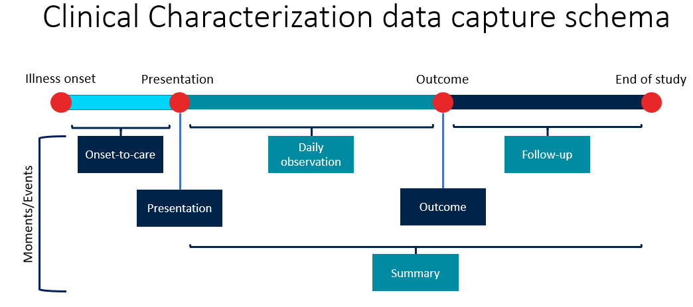

.. _data-capture-schema:

Data Capture Schema
===================

The ARC data structure follows the **Clinical Characterization data capture schema**, illustrated below:

This schema defines the key moments/events during a patient’s journey in a study:

- **Illness onset** → includes onset-to-care information.
- **Presentation** → data collected when the patient first presents to care.
- **Daily observation** → repeated measurements and clinical observations throughout the admission.
- **Outcome** → information recorded at the conclusion of the admission (e.g., discharge, death).
- **Follow-up** → post-discharge information, up to the defined end of study.
- **Summary** → aggregate or synthesized data spanning the full admission.
